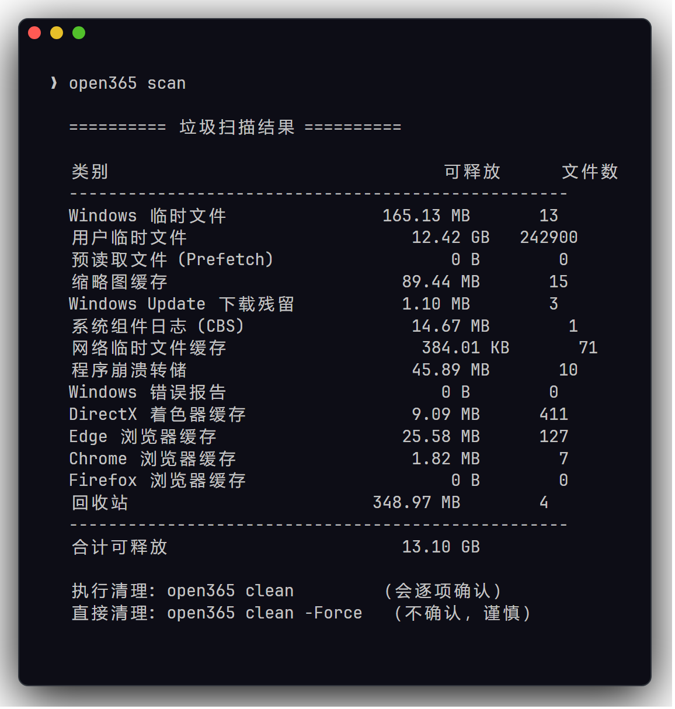

<h1 align="center">Open365 · 开源电脑助手</h1>

<p align="center"><strong>无广告、无弹窗、无捆绑、不联网上传的开源 Windows 电脑维护工具。</strong></p>

<p align="center">
  <a href="#安装">安装</a> ·
  <a href="#功能v1">功能</a> ·
  <a href="README.en.md">English</a> ·
  <a href="AGENTS.md">AI 自动化说明</a>
</p>

[](LICENSE)

<p align="center">
  
</p>

## 为什么做这个

市面上的"安全卫士 / 电脑管家"类软件功能实用，但普遍广告弹窗多、捆绑安装、
后台常驻、行为不透明。Open365 用开源、透明的方式把最常用的几个电脑维护功能
重做一遍 —— 让你**看得见每一步、装得放心、随时能卸**。

**核心理念**：所有操作都基于 Windows 自带能力（`netsh` / `ipconfig` / 注册表 / `Get-*` cmdlet），
没有自研驱动、没有后台服务、没有联网上传。源码就是几个 PowerShell 脚本，记事本就能看。

## 功能（v1）

| 功能 | 说明 | 对应能力 |
|------|------|------------|
| 🔧 **网络修复** | 智能诊断 + 一键修复"微信能上、网页打不开"（LSP/Winsock/DNS/代理） | 断网修复、LSP修复、DNS优选 |
| 🧹 **垃圾清理** | 扫描+清理临时文件/浏览器缓存/回收站/缩略图缓存等（先报告再删） | 电脑清理、垃圾清理 |
| 🚀 **开机加速** | 列出并管理开机启动项，**禁用可一键还原** | 优化加速、启动项管理 |
| 🧠 **进程管理** | 列出运行进程并一键结束占用资源的进程，**关键系统进程自动保护、禁止结束** | 任务管理、进程查看 |
| 🗑️ **强力卸载** | 列出/搜索/卸载软件 + **残留一键清理**（顽固/捆绑软件也能卸；残留目录移备份区、注册表导出后删，可还原） | 软件管家、强力卸载 |
| 🛡️ **安全护盾** | 自检并一键开启 **Windows 自带**的实时杀毒(Defender)/防火墙/系统更新 | 木马查杀、防护中心、漏洞修复 |
| 🌙 **守夜模式** | 让 AI 通宵干活时电脑**不熄屏/不睡眠/不锁屏/不被更新重启**，退出自动还原（面向 AI 时代） | —（AI 时代新需求） |

### 换/卸第三方安全软件前必看：杀毒/防火墙/补丁不会丢

电脑安全真正不可缺的就三样，而且**全是 Windows 自带的**：实时杀毒由
**Windows Defender** 负责、防火墙由 **Windows 防火墙** 负责、补丁由 **Windows Update** 负责。
有些第三方安全软件装上后会把这三样**偷偷关掉/接管**——所以卸载它们后唯一要做的，就是确认它们重新开着。
`security check` 负责自检，`security enable-all` 一键复位。

### 亮点：网络修复是"会思考"的

不像那种"一键瞎修"，Open365 先做**双路探测**（直连 vs 走系统代理），精准定位病因：

- 绕过代理能上网、走代理上不了 → **确诊是代理问题**（流氓软件偷设/梯子失效）
- IP+DNS 正常但 HTTP 出不去 → **Winsock/LSP 损坏**（微信走私有协议还能用，浏览器废了）
- IP 通、域名解析失败 → **DNS 故障**

每种病因给出对应的最小修复，不乱重置。

## 安装

### 一键安装（推荐）

克隆仓库后，在仓库目录里跑一条命令即可（用 Windows 自带 csc 编译，无需装任何 SDK）：

```powershell
powershell -ExecutionPolicy Bypass -File install.ps1
```

- 想开机自启：加 `-Autostart`
- 只编译不启动：加 `-NoLaunch`
- 卸载：`powershell -ExecutionPolicy Bypass -File install.ps1 -Uninstall`（只删快捷方式/自启，不碰源码和你的数据）

安装脚本会：编译 `Open365.exe` → 在桌面建「Open365」快捷方式 → 启动托盘。全程离线、幂等、可重复跑。

### 让 AI 帮你装

如果你在用 AI 助手（Claude Code / Cursor 等）装机，直接把仓库地址给它，它会读根目录的 **[AGENTS.md](AGENTS.md)** ——里面有面向 AI 的结构化安装/验证/调用说明（带退出码判断），可无人值守装好。

## 用法

### 给朋友：双击即用

把整个 `Open365` 文件夹发给朋友，让他双击 **`open365.bat`**（会自动请求管理员权限），
进中文菜单，按数字选功能。零安装、零依赖。

### 图形界面：管理中心

双击 **`Open365.exe`** 会在右下角常驻一个托盘盾牌图标（内存极低）。点它打开仿 WinUtil 的
「管理中心」——左侧导航、右侧功能页，**八大功能全部图形化**：

- **💻 电脑体检**：一键并行检查 安全防线 / 垃圾 / 开机自启 / 网络，给出**综合评分**（表盘扫动动画），
  外加一排**真实防护数值**（已守护天数 / 三道防线开启数 / 累计清理垃圾 / 病毒库更新），
  发现的问题逐项列出、点按钮直达对应页面修复。数值全来自本机统计，不联网、不上报。
- **🚀 开机启动**：每项 `[启用]/[禁用]` 一键切换（禁用是移到备份处、可一键还原，不是删除）。
- **🧠 运行进程**：按内存排序，每项 `[结束]`；**关键系统进程置灰、禁止结束**，不会把电脑搞死机。
- **🧹 垃圾清理**：扫描结果逐类勾选（**回收站默认不勾**，清空找不回的事让你自己决定），看清大小再清理。
- **🔧 网络修复**：五项连通性逐项亮灯 + 病因结论，按病因给**最小修复**按钮，另有清代理/换DNS快捷键。
- **🛡️ 安全护盾**：三道防线逐行状态 + 单项开启 / 一键复位 / 快速查杀 / 更新病毒库。
- **🗑️ 软件卸载**：搜索 + 列表 + 行内 `[卸载]` `[查残留]`；残留弹窗里可**一键清理（可还原）**——
  目录移到备份区、注册表导出后删，备份区带「还原说明」，随时搬回。
- **🌙 守夜模式**：图形开关，可设时长/是否允许熄屏，退出自动还原（进程内实现，关掉即还原）。

GUI 只是个"按钮面板"：它读引擎的 `-Json` 输出来渲染、点按钮就调对应引擎，所有真正的动作都在
`engine/*.ps1` 里、看得见。改 GUI 后用 `tools\build-gui.ps1` 重新编译（用 Windows 自带 csc，无需装任何 SDK）。

### 命令行（高级）

```powershell
# 网络
open365 network diagnose          # 网络体检（只读，自动判断病因）
open365 network repair-all        # 一键全修复
open365 network clear-proxy       # 清除被流氓软件设的代理

# 清理
open365 scan                      # 扫描垃圾（只报告）
open365 clean                     # 清理（逐项确认）

# 启动项
open365 startup list              # 列出开机启动项
open365 startup disable -Id <id>  # 禁用（可还原）
open365 startup enable  -Id <id>  # 恢复

# 进程
open365 process list              # 列出运行进程（按内存排序，只读）
open365 process kill -Id <PID>    # 结束某个进程（关键系统进程会被拒绝）

# 卸载
open365 uninstall search <关键词>       # 按名字搜软件全家桶
open365 uninstall uninstall <id>       # 卸载
open365 uninstall residue <关键词>      # 扫残留（只报告）
open365 uninstall residue-clean <关键词> # 清残留：目录移备份区+注册表导出后删（可还原）

# 安全护盾（换/卸杀软前必跑）
open365 security check             # 自检：Defender/防火墙/更新 是否都开着（只读）
open365 security enable-all        # 一键复位：开启实时防护+防火墙+Update 服务
open365 security scan              # 用 Defender 跑一次快速扫描

# 守夜模式（让 AI 通宵干活，电脑不熄屏/不睡眠/不被更新重启）
open365 focus on                  # 进入守夜模式，按任意键退出（自动还原）
open365 focus on -Hours 8         # 守 8 小时后自动退出
open365 focus on -AllowScreenOff  # 只防睡眠，允许屏幕熄灭省电
open365 focus on -AllowUpdateReboot  # 不挡更新重启（默认会临时挡，需管理员）
open365 focus status              # 看当前熄屏/睡眠超时（只读）
```

所有引擎都支持 `-Json` 输出结构化结果，方便接 GUI / 自动化。

## 安全设计

- **只读优先**：诊断、扫描、列表都不改任何东西，先看清楚再动手。
- **可还原**：启动项禁用是"移到备份键/目录"，不是删除，随时一键恢复。
- **不可逆操作要确认**：卸载软件、删文件前都需确认（或显式 `-Yes`/`-Force`）。
- **白名单**：垃圾清理只碰公认安全的缓存/临时目录，不碰文档/桌面/下载；进程管理对关键系统进程一律拒绝结束。
- **透明**：核心是纯 PowerShell + bat；图形外壳是 C# WinForms（源码在 `gui/`，用系统自带 csc 编译，无第三方依赖、无网络请求）。

## 一个动作，三个入口（影核协议）

Open365 的按钮、命令行和 AI 调用指向**同一个动作实现**，不是三份各写各的代码。
这套规范是 [ActionParity / 影核协议](https://github.com/dongsheng123132/action-parity)。

```powershell
powershell -File core\action-core.ps1 list -Json                     # 有哪些动作
powershell -File core\action-core.ps1 describe security.check -Json  # 契约自描述
powershell -File core\action-core.ps1 run security.check -Json       # 执行
powershell -File core\action-core.ps1 verify                         # 无头自测全套
```

给 Codex / Claude Code / Hermes 开发本项目时，根目录还提供了可发现的
`action-parity.config.json` 和可执行证据计划 `action-parity.verify.json`；AI 不用先通读规范，
运行 `action-parity context . --json` 就能知道注册表、生成物和完成检查在哪里。

好处很直接：改系统的动作默认拒绝执行（必须显式 `-Confirm`）；引擎输出一旦漂移会
当场报错，而不是让界面读到 `null`；AI 不用截图点鼠标就能把业务逻辑整轮测一遍。
详见 [docs/影核协议改造.md](docs/影核协议改造.md)。

## 测试

```powershell
powershell -ExecutionPolicy Bypass -File tests\run-all.ps1
```

自测会**模拟真实故障再验证修复**（如注入假代理、在沙盒造垃圾文件、起一个一次性进程再结束、
造假残留再清理并验证可还原），全程不碰你的真实数据，结束自动还原。当前 6 个测试套件、40+ 项断言全过。

## 路线图

- [x] 网络修复引擎（已自测）
- [x] 垃圾清理引擎（已自测）
- [x] 启动项管理引擎（已自测）
- [x] 进程管理引擎（list/kill，关键系统进程保护，已自测）
- [x] 强力卸载引擎
- [x] 安全护盾引擎（Defender/防火墙/更新 自检+一键复位，已实测）
- [x] 守夜模式引擎（AI 通宵干活防熄屏/防睡眠，退出自动还原，已实测）
- [x] 图形界面：托盘常驻 + 「管理中心」（开机启动 / 进程 一键开关，C# WinForms，系统 csc 编译、零依赖）
- [x] 网络 / 清理 / 安全 / 卸载 / 守夜 全部图形化（勾选清理、连通性亮灯、防线状态行、搜索卸载、守夜开关）
- [x] 电脑体检：综合评分 + 问题清单 + 逐项直达修复（安全/垃圾/自启/网络 并行检查）；评分表盘扫动动画
- [x] 残留一键清理（目录移到备份区 + 注册表导出后删，可还原；危险/过短关键词安全拦截；已自测）
- [ ] 清理规则扩充（更多浏览器 / 常见软件缓存）

## 技术栈

- 核心引擎：PowerShell（Windows 自带，零依赖）
- 图形界面：C# WinForms（用 Windows 自带 .NET / csc 编译，无第三方依赖；源码在 `gui/`，`tools\build-gui.ps1` 一键重编）
- 协议：Apache-2.0（含专利授权保护，对全球/商业场景更稳）

## License

[Apache-2.0](LICENSE) —— 自由使用、修改、商用，含专利授权条款。

> 集成的第三方开源组件各自保留其原始许可证与署名（见 `NOTICE`）。
> Open365 只集成**宽松许可**(MIT/Apache/BSD/MPL/ISC)的组件，不集成 GPL/AGPL 代码。
